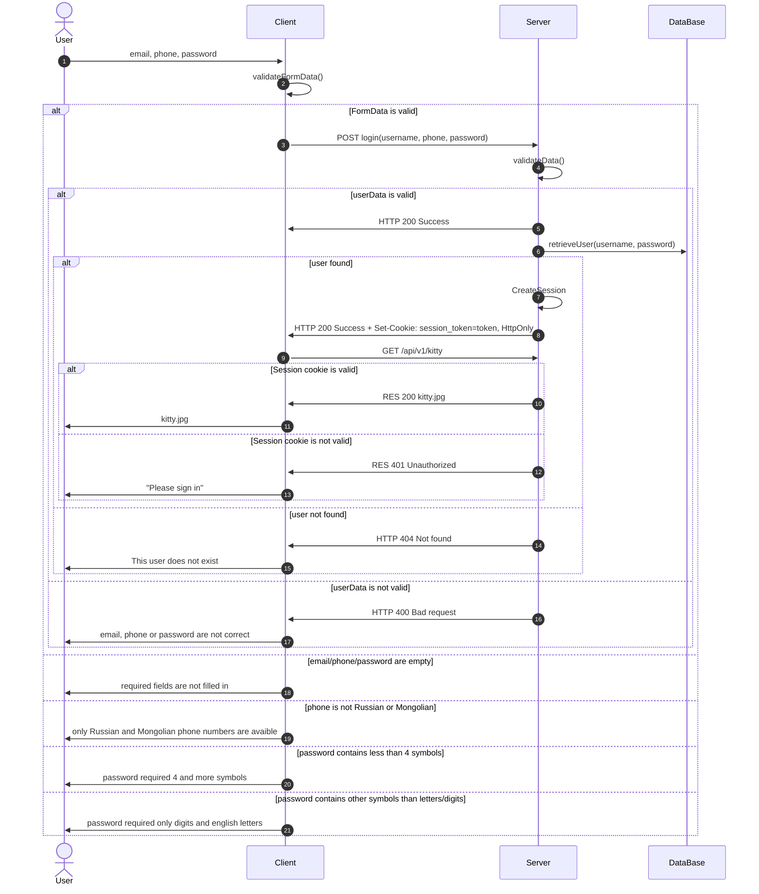

```mermaid
sequenceDiagram
autonumber
actor User
participant Client
participant Server
participant DataBase

User->>+Client: email, phone, password
Client->>Client: validateFormData()
alt FormData is valid

Client->>Server: POST login(username, phone, password)
Server->>Server: validateData()

alt userData is valid
    Server->>Client: HTTP 200 Success
    Server->>DataBase: retrieveUser(username, password)
    alt user found
        Server->>Server: CreateSession
        Server->>Client: HTTP 200 Success + Set-Cookie: session_token=token, HttpOnly
        Client->>Server: GET /api/v1/kitty
        alt Session cookie is valid
            Server->>Client: RES 200 kitty.jpg
            Client->>User: kitty.jpg
        else Session cookie is not valid
            Server->>Client: RES 401 Unauthorized
            Client->>User: "Please sign in"
        end
    else user not found
        Server->>Client: HTTP 404 Not found
        Client->>User: This user does not exist
    end
    
else userData is not valid
    Server->>Client: HTTP 400 Bad request
    Client->>User: email, phone or password are not correct
end

else email/phone/password are empty 
    Client->>User: required fields are not filled in
else phone is not Russian or Mongolian
    Client->>User: only Russian and Mongolian phone numbers are avaible 
else password contains less than 4 symbols
    Client->>User: password required 4 and more symbols
else password contains other symbols than letters/digits
    Client->>User: password required only digits and english letters
end

```
